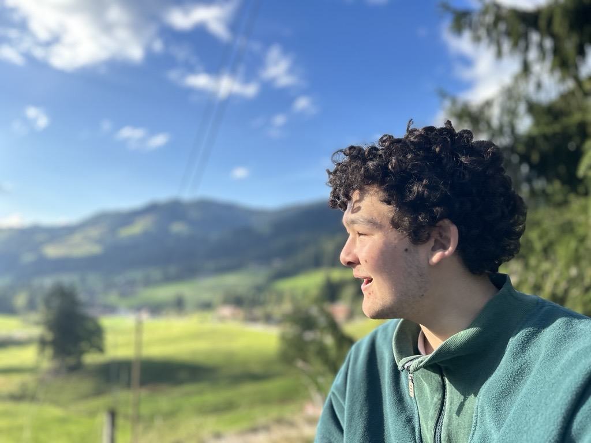

+++
title = "Japan, England, die Schweiz - und ich?"
date = "2025-02-21"
draft = false
pinned = false
tags = []
image = "image-3-.jpg"
+++


Es ist nicht ungewöhnlich, mit mehreren kulturellen Einflüssen aufzuwachsen, aber was bedeutet das für die Identität? Fumito Browne hat englisch-japanische Wurzeln, lebte in Japan und England und lebt nun seit über zehn Jahren in der Schweiz. In diesem Interview spricht er über Anpassung, Zugehörigkeit, Herausforderungen und über die Frage, wo er sich wirklich zu Hause fühlt.



> Immer neugierig.
>
> *Fumito Browne*

Wir setzen uns in einen Park in Langenthal, es ist ein trüber Tag, und es riecht nach japanischem Essen. Sein liebstes asiatisches Restaurant liegt gleich um die Ecke. Während um uns Kinder spielen, erzählt Fumito offen über seine Erfahrungen mit einer hybriden Identität. Man sieht ihm an, dass er sich auf das Interview freut.


Fumito Robert Browne hat in Japan das Licht erblickt und verbrachte dort die ersten 8 Jahre seines Lebens, bevor er für ein Jahr nach England zog. Nun lebt er seit über 10 Jahren in der Schweiz. Mit seinem Multikulturellem Hintergrund und seinen Erfahrungen aus 3 Ländern kennt er die Herausforderungen hybrider Identitäten aus erster Hand. Heute macht Fumito eine Lehre als Polymechaniker.


**Leo Boghenbor: Kannst du mir etwas über deine Herkunft erzählen? Wo bist du geboren und wo bist du aufgewachsen?**
Fumito Browne: Ich heiße Fumito Browne, ich komme aus Japan und England. Ich bin 20 Jahre alt, meine Mutter ist Japanerin, mein Vater ist Engländer. Ich bin in Japan geboren, ich denke Yokohama, aber am längsten habe ich in Tokyo gewohnt.

**Also kannst du flüssig Japanisch?**
Ja, sprechen kann ich flüssig. Schreiben kann ich nur Hiragana, Katakana. Kanji habe ich ein bisschen Schwierigkeiten. Aber als ich in Japan war, ging ich nur in den Kindergarten sozusagen. Und nachdem ging ich nach England, dort ging ich auch zur Schule.

**Wie würdest du deine Identität in einem Satz beschreiben?**
Ich würde mich als immer neugierig beschreiben.

**Gibt es Momente, in denen du dich mehr Englisch oder Japanisch fühlst?**
Zum Beispiel, wenn ich so im ÖV bin und ich sehe die Jungen und die geben keine Sitzplätze an die alten Frauen, dann fühle ich mich sehr japanisch und ich würde sie gerne darauf ansprechen. Wenn ich laut spreche und etwas trinke fühle ich mich wie ein Engländer.

**Wie war es für dich in Japan aufzuwachsen?**
Japan ist ein recht strenges Land. Du musst in eine Schachtel passen und wenn du nicht reinpasst, bist du wie ein Aussenseiter. Japan ist eigentlich ein schönes Land und ich liebe, dass wir so höflich sind, aber ich finde, es ist ein bisschen zu anstrengend. Du musst immer eine Maske tragen und immer lächeln, auch wenn es dir schlecht geht.

> Die Schweizer Jugend wird ein Kulturschock für die japanischen Eltern sein.
>
> *Fumito Browne*

**Gibt es bestimmte Werte und Traditionen aus England, Japan oder der Schweiz, die du besonders wichtig findest?**
Die Schweizer Pünktlichkeit finde ich sehr gut. In Japan finde ich, wie man sich in der Öffentlichkeit verhält, recht gut.

**Gibt es einen Unterschied zwischen deiner japanischen und englischen Familie?**
Es hat einen Unterschied zwischen japanischer und englischer Familie. Vor meiner japanischen Familie muss ich mich höflicher verhalten. Also ich darf nicht über alles sprechen in meinem Leben, denn ich kann nicht zu offen sein. Die Schweizer Jugend wird ein Kulturschock für die japanischen Eltern sein. Bei der englischen Familie kann ich über alles reden. England ist ähnlich zu der Schweiz.

**Gibt es Dinge an der japanischen Kultur, die du sehr vermisst? Und gibt es Aspekte, die du an der schweizerischen Kultur besonders schätzt?**
Ich mag japanisches Essen sehr. Ich vermisse auch allgemein einfach so Japan, im Ganzen, nicht Kultur, aber so die Luft dort. Aber ich muss sagen, das Hanne-Wasser von der Schweiz ist viel besser als das Frischwasser in Japan. Ferien, logischerweise, sind in der Schweiz besser. Allgemein so die Arbeit, so das Mindset für die Arbeit ist in der Schweiz viel, viel, besser.

**Gibt es kulturelle Unterschiede in der Art, wie du erzogen wurdest, im Vergleich zu deinen schweizerischen Freunden?**
Ich habe bemerkt, dass die Schweizer Kinder sehr mutterabhängig. Nicht, dass es so ist, aber die Mutter macht mehr, das ist der soziale Standard in der Schweiz. In Japan gibt es auch logischerweise Mütter, die viel für die Kinder machen. Aber oftmals, wie meine Mutter, lässt man die Kinder von Anfang an viel selbst machen.

> Jeder macht sein eigenes Ding.
>
> *Fumito Browne*

**Wo fühlst du dich am meisten zu Hause?**
Also mein Zuhause ist in der Schweiz, also ich fühle mich schon am meisten in der Schweiz zu Hause. Japan ist für mich schon fast zu einem Ferienort geworden. Ich gehe nur noch dort hin, um mich zu erholen. Aber ich sehe es nicht mehr als zu Hause.

**Welchen Rat würdest du anderen jungen Menschen geben, mit einem ähnlichen multikulturellen Hintergrund wie du, die Schwierigkeiten haben mit ihrer Identität oder Schwierigkeiten haben sich zu integrieren?**
Einfach nicht darauf eingehen, wenn sie dich beleidigen. Jeder macht sein eigenes Ding. Du musst nicht unbedingt integriert sein, du musst es einfach probieren. Solange du es probierst und solange du dir Mühe gibst, werden sie dich aufnehmen. Weil die Schweiz eben ein sehr offenes, multikulturelles Land ist.